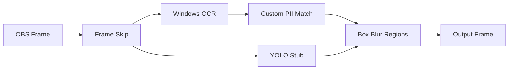

# IRLSAFETY+

**Real-time privacy protection for OBS Studio** — an overlay filter that detects and blurs PII in live streams (street signs, license plates, IDs, documents, screen text, faces, and your custom keywords).

| | |
|---|---|
| **Version** | 0.1.0 — Custom PII OCR + blur working on Windows |
| **Platform** | Windows 10/11 x64 |
| **OBS** | 31.x (64-bit) |
| **License** | MIT ([LICENSE](LICENSE)) — OBS/libobs is GPLv2 when running inside OBS |

---

## Quick Start for Streamers (3 steps)

### Option A — v0.1 test package (easiest)

```bat
scripts\package-v0.1.bat
```

1. Open `release\IRLSAFETY+-v0.1.0-win64\`
2. Double-click **`install-from-package.bat`**
3. Restart OBS → right-click any source → **Filters** → **+** → **IRLSAFETY+ PII Blur**

### Option B — Build from source

```bat
scripts\build-windows.bat
scripts\install-to-obs.bat
```

---

## v0.1 — Custom PII blur (working now)

**Goal:** Add your name in settings, show an ID or paper with that name on camera, and see it blurred in real time.

1. Add the **IRLSAFETY+ PII Blur** filter to your webcam (or any source)
2. Turn on **Enable All Protection** and **Custom PII**
3. In **Custom PII (one per line)**, enter your name:
   ```
   John Smith
   ```
   Or browse to a `.txt` file (`data/custom-pii.example.txt` is a template)
4. Point your camera at text containing that name
5. Matched text is blurred using **Windows OCR** + **case-insensitive** keyword matching

**Tips:**
- Increase **Blur Intensity** (default 12) for stronger obfuscation
- Set **Process Every N Frames** to `2` or `3` if CPU usage is high
- Enable **Enable Debug Logging** to see match counts in the OBS log

### What works in v0.1

| Feature | Status |
|---------|--------|
| Custom PII list (inline + file) | **Working** |
| Windows OCR text detection | **Working** |
| Case-insensitive PII match | **Working** |
| Box blur on matched regions | **Working** |
| Master + category toggles | **Working** |
| Screen Text (all OCR text) | **Working** (basic — blurs all detected text) |
| Street Signs / Plates / Docs / Faces | Stub (awaiting YOLO/ONNX) |
| Detection tracking | Planned |
| GPU ONNX inference | Planned |

---

## Using the Filter in OBS

1. **Enable All Protection** — master on/off
2. **Protection Categories** — toggle each class independently
3. **Custom PII List** — names, addresses, usernames (one per line)
4. **Detection & Blur** — confidence, frame skip, blur intensity
5. **Advanced** — GPU preference, debug logging, ONNX model path

---

## Architecture (v0.1)



| Module | File | Role |
|--------|------|------|
| Filter UI | `src/pii-filter.c` | OBS properties + `filter_video` |
| OCR | `src/ocr/ocr_windows.cpp` | Windows.Media.Ocr word boxes |
| PII match | `src/ocr/pii_match.c` | Case-insensitive keyword match |
| Blur | `src/blur/blur_compositor.c` | In-place box blur (BGRA / I420) |
| Custom PII | `src/custom_pii.c` | Parse inline + file lists |
| Pipeline | `src/pipeline.c` | Category gates + orchestration |

---

## Build from Source (Windows 10/11)

### Prerequisites

- Visual Studio 2022 with **Desktop development with C++**
- CMake 3.28+ (bundled with VS)
- OBS Studio 31.x installed (for testing)

### Commands

```bat
scripts\build-windows.bat          REM configure + build + test
scripts\install-to-obs.bat         REM install to Program Files\obs-studio
scripts\package-v0.1.bat           REM create release\IRLSAFETY+-v0.1.0-win64\
```

---

## Project Layout

```
IRLSAFETY-obs/
├── scripts/              build, install, package batch files
├── release/              INSTALL notes + packaged builds
├── src/ocr/              Windows OCR, PII matching, frame conversion
├── src/blur/             Box blur compositor
├── data/custom-pii.example.txt
└── tests/                Unit tests (match, blur, OBS entry points)
```

---

## Roadmap

- [x] Custom PII OCR + blur (v0.1)
- [ ] YOLOv8n ONNX for signs, plates, documents, faces
- [ ] ONNX Runtime GPU path
- [ ] Detection tracking across frames
- [ ] Detection preview overlay
- [ ] Audio PII muting

---

## Attributions

See [THIRD_PARTY_NOTICES.md](THIRD_PARTY_NOTICES.md) — OBS Studio, obs-plugintemplate, obs-detect, obs-ocr, Ultralytics YOLO, EasyOCR, ONNX Runtime, Windows OCR API.