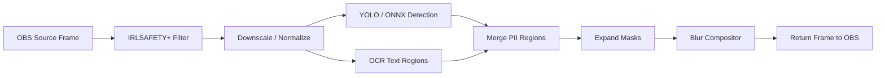

# IRLSAFETY+

**IRLSAFETY+** is an OBS Studio plugin that blurs personally identifiable information (PII) in real time during live streams and recordings. The plugin runs as a video filter on any OBS source, detecting sensitive regions with YOLO/ONNX object detection and OCR, then compositing a blur over those areas before the frame reaches the output.

> **License note:** This plugin's source code is licensed under the [MIT License](LICENSE). OBS Studio and `libobs` are licensed under GPLv2. When you build, link, or distribute this plugin for use inside OBS, you must comply with OBS's GPL obligations in addition to this project's MIT terms.

## Features (planned)

- Real-time PII blurring via an OBS video filter
- YOLO object detection through ONNX Runtime
- OCR pass for text-based PII (names, emails, phone numbers, IDs)
- Configurable blur strength
- Windows-first build targeting OBS 31.x

## Architecture

The runtime pipeline processes each video frame inside the OBS filter callback:



### Pipeline stages

| Stage | Module | Responsibility |
|-------|--------|----------------|
| 1. Frame ingest | `src/pii-filter.c` | OBS `filter_video` / `video_tick` hooks receive CPU frame buffers |
| 2. Object detection | `src/detection/yolo_onnx.c` | `detect_regions()` — planned ONNX Runtime inference with a YOLO ONNX model |
| 3. OCR | `src/ocr/ocr_engine.c` | `ocr_regions()` — planned text extraction and PII classification |
| 4. Mask merge | `src/pipeline.c` | Combines YOLO boxes with OCR text boxes into a unified region list |
| 5. Blur | `src/blur/blur_compositor.c` | `apply_blur()` — planned Gaussian/pixelate compositing over masked regions |

Current scaffold ships stub implementations that register the filter and wire the pipeline without performing inference or blur.

## Windows build prerequisites

1. **Visual Studio 2022** with the "Desktop development with C++" workload
2. **CMake 3.28+** ([cmake.org](https://cmake.org/download/))
3. **OBS Studio 31.x development files** (`libobs`, headers, and CMake package config)
4. *(Future)* ONNX Runtime, a YOLO ONNX model, and an OCR backend (Tesseract or ONNX-based OCR)

### Obtaining OBS development files

**Option A — Build OBS from source (recommended for development)**

```powershell
git clone --recursive https://github.com/obsproject/obs-studio.git
cd obs-studio
cmake --preset windows-x64
cmake --build build_x64 --config RelWithDebInfo
```

After building, set `CMAKE_PREFIX_PATH` to the OBS build's `cmake` package directory (typically `build_x64`).

**Option B — Use an installed OBS Studio**

If you have OBS Studio installed with developer components, point CMake at the install prefix:

```powershell
$env:CMAKE_PREFIX_PATH = "C:\Program Files\obs-studio\cmake"
```

## Windows build instructions

### Using CMake presets (recommended)

From the project root:

```powershell
cd C:\Users\White\Desktop\IRLSAFETY-obs

# Configure (requires libobs on CMAKE_PREFIX_PATH)
cmake --preset windows-x64

# Build
cmake --build build_x64 --config RelWithDebInfo

# Run stub unit tests (no OBS runtime required)
ctest --test-dir build_x64 -C RelWithDebInfo --output-on-failure
```

### Manual configure

```powershell
cmake -S . -B build -G "Visual Studio 17 2022" -A x64 `
  -DCMAKE_PREFIX_PATH="C:\path\to\obs-studio\build_x64"
cmake --build build --config RelWithDebInfo
```

### Output locations

| Artifact | Path |
|----------|------|
| Plugin DLL | `build_x64/rundir/RelWithDebInfo/irlsafety-plus.dll` |
| Locale data | `build_x64/rundir/RelWithDebInfo/irlsafety-plus/` |
| Install target | `%ProgramData%\obs-studio\plugins\irlsafety-plus\` |

Copy the `rundir` output into your OBS plugins folder to test locally.

## Project layout

```
IRLSAFETY-obs/
├── CMakeLists.txt          # Root CMake project
├── CMakePresets.json       # Windows x64 preset (and others from template)
├── buildspec.json          # Plugin metadata (name, version, OBS deps)
├── cmake/                  # OBS template CMake helpers
├── build-aux/              # Formatting and build utilities
├── data/locale/            # OBS locale strings
├── src/
│   ├── plugin-main.c       # Module load / filter registration
│   ├── pii-filter.c        # OBS video filter
│   ├── pipeline.c          # Detection → OCR → blur orchestration
│   ├── detection/          # YOLO/ONNX stub
│   ├── ocr/                # OCR stub
│   └── blur/               # Blur compositor stub
└── tests/                  # Pipeline stub unit tests
```

## Attributions

| Component | License | Source |
|-----------|---------|--------|
| OBS Plugin Template | GPLv2 | [obsproject/obs-plugintemplate](https://github.com/obsproject/obs-plugintemplate) |
| OBS Studio / libobs | GPLv2 | [obsproject/obs-studio](https://github.com/obsproject/obs-studio) |
| IRLSAFETY+ plugin source | MIT | This repository |
| ONNX Runtime *(planned)* | MIT | [microsoft/onnxruntime](https://github.com/microsoft/onnxruntime) |
| YOLO models *(planned)* | Model-specific | Ultralytics YOLOv8/v11 ONNX exports |
| OCR backend *(planned)* | Apache 2.0 / MIT | Tesseract or ONNX-based OCR (TBD) |

## Roadmap

- [ ] Integrate ONNX Runtime for YOLO inference
- [ ] Add OCR engine with PII classification rules
- [ ] Implement GPU-accelerated blur compositing
- [ ] Filter properties UI (model path, sensitivity, blur type)
- [ ] Performance profiling and frame-skip tuning for real-time use