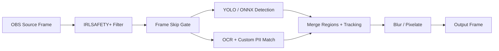

# IRLSAFETY+

**Real-time privacy protection for OBS Studio** — an overlay filter that detects and blurs PII in live streams (street signs, license plates, IDs, documents, screen text, faces, and your custom keywords).

| | |
|---|---|
| **Version** | 0.0.0 (scaffold — UI wired, inference coming next) |
| **Platform** | Windows 10/11 x64 |
| **OBS** | 31.x (64-bit) |
| **License** | MIT ([LICENSE](LICENSE)) — OBS/libobs is GPLv2 when running inside OBS |

---

## Quick Start for Streamers (3 steps)

### Option A — Test package (easiest)

1. Open `release\IRLSAFETY+-v0.0.0-win64\` (create it with `scripts\package-v0.0.bat` if missing)
2. Double-click **`install-from-package.bat`**
3. Restart OBS → right-click any source → **Filters** → **+** → **IRLSAFETY+ PII Blur**

### Option B — Build from source

```bat
scripts\build-windows.bat
scripts\install-to-obs.bat
```

Restart OBS and add the filter as above.

---

## Using the Filter in OBS

1. Add **IRLSAFETY+ PII Blur** to any video source (camera, display capture, etc.)
2. **Enable All Protection** — master on/off at the top
3. Toggle categories:
   - Street Signs
   - License Plates
   - Documents / IDs
   - Faces
   - Screen Text
   - **Custom PII** (always blur your own list)
4. **Custom PII List**
   - Type entries directly (one per line): names, addresses, phone numbers, usernames
   - Or browse to a `.txt` file (see `data/custom-pii.example.txt`)
5. Tune **Confidence**, **Process Every N Frames** (performance), and **Blur Intensity**

### v0.0.0 status

The property UI and pipeline are fully wired. ONNX/YOLO detection, OCR matching, tracking, and real blur masks are **stubs** in this release — settings persist in your scene for when inference is enabled.

---

## Filter Properties Reference

| Setting | Description |
|---------|-------------|
| Enable All Protection | Master toggle — off = passthrough |
| Category toggles | Enable/disable detection classes |
| Custom PII (inline) | Multiline keyword list |
| Load PII from text file | Optional `.txt` file (one entry per line, `#` comments) |
| Confidence Threshold | Detection sensitivity (0.1–0.95) |
| Process Every N Frames | `1` = every frame; higher = better performance |
| Blur Intensity | 1–32 strength |
| Prefer GPU | Use ONNX/TensorRT GPU when available *(future)* |
| Show Detection Preview | Debug overlay *(future)* |
| Enable Debug Logging | Verbose OBS log output |
| YOLO ONNX Model Path | Path to YOLOv8n ONNX model *(future)* |

---

## Architecture



| Module | File | Role |
|--------|------|------|
| Filter UI | `src/pii-filter.c` | OBS properties, `filter_video`, `video_tick` |
| Settings | `src/filter_settings.c` | Load/save toggles and thresholds |
| Custom PII | `src/custom_pii.c` | Parse inline + file keyword lists |
| Frame convert | `src/frame_convert.c` | Multi-planar YUV/RGB → pipeline view |
| Detection | `src/detection/yolo_onnx.c` | YOLO via ONNX Runtime *(stub)* |
| OCR | `src/ocr/ocr_engine.c` | Text + fuzzy/semantic PII *(stub)* |
| Blur | `src/blur/blur_compositor.c` | Gaussian / pixelate *(stub)* |
| Pipeline | `src/pipeline.c` | Orchestration + category gates |

---

## Build from Source (Windows 10/11)

### Prerequisites

1. **Visual Studio 2022** — "Desktop development with C++" workload
2. **CMake 3.28+** (included with VS or from [cmake.org](https://cmake.org/download/))
3. **OBS Studio 31.x** installed (for testing only — build auto-downloads OBS SDK via template)

### One-click build

```bat
cd C:\Users\White\Desktop\IRLSAFETY-obs
scripts\build-windows.bat
```

This configures with `windows-x64` preset, builds `RelWithDebInfo`, and runs unit tests.

### Manual build

```powershell
cmake --preset windows-x64
cmake --build build_x64 --config RelWithDebInfo
ctest --test-dir build_x64 -C RelWithDebInfo --output-on-failure
```

### Install into OBS

```bat
scripts\install-to-obs.bat
```

Copies to:
- `%ProgramFiles%\obs-studio\obs-plugins\64bit\irlsafety-plus.dll`
- `%ProgramFiles%\obs-studio\data\obs-plugins\irlsafety-plus\`

### Create v0.0 test package

```bat
scripts\package-v0.0.bat
```

Output: `release\IRLSAFETY+-v0.0.0-win64\` — zip and share for easy testing.

---

## Project Layout

```
IRLSAFETY-obs/
├── scripts/           build-windows.bat, install-to-obs.bat, package-v0.0.bat
├── release/           INSTALL.txt + packaged builds
├── src/               Plugin source
├── data/locale/       OBS UI strings
├── data/              custom-pii.example.txt
├── tests/             Unit tests (pipeline + OBS entry points)
├── cmake/             OBS template helpers
├── LICENSE            MIT
└── THIRD_PARTY_NOTICES.md
```

---

## Roadmap (post v0.0)

- [ ] ONNX Runtime + YOLOv8n ONNX inference (GPU + CPU)
- [ ] EasyOCR / Tesseract integration + custom keyword fuzzy match
- [ ] Detection tracking across frames
- [ ] Gaussian blur / pixelate compositing
- [ ] Detection preview overlay
- [ ] Audio PII muting (extensibility hook)

---

## Attributions

See [THIRD_PARTY_NOTICES.md](THIRD_PARTY_NOTICES.md) for full license table including OBS Studio, obs-plugintemplate, obs-detect, obs-ocr, Ultralytics YOLO, EasyOCR, ONNX Runtime, and Tesseract.

> **GPL note:** IRLSAFETY+ source is MIT, but linking/running inside OBS requires compliance with OBS's GPLv2 terms.